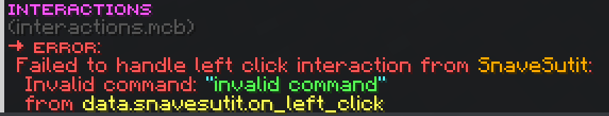

# Interactions

Lets you specify commands for interaction entities to run when a player left or right clicks them.

## Installing

To install this library, add the `interactions.mcb` file to your `src` folder. (Sub-folders are supported)

## Usage

```mcfunction
summon interaction ~ ~ ~ { \
	Tags: ['snavesutit.interactions.interactable'], \
	data: { \
		snavesutit: { \
			on_left_click: "say I was left-clicked!", \
			on_right_click: "say I was right-clicked!" \
		} \
	} \
}
```

The player interacting with the entity can be accessed via `execute on target` for right-click, and `execute on attacker` for left-click:

```mcfunction
summon interaction ~ ~ ~ { \
	Tags: ['snavesutit.interactions.interactable'], \
	data: { \
		snavesutit: { \
			on_left_click: "execute on attacker run say I left-clicked an interaction!", \
			on_right_click: "execute on target run say I right-clicked an interaction!" \
		} \
	} \
}
```

If the given command is invalid, the interaction will show an error message in chat:



## Customization

You can change the tag and NBT prefix (`snavesutit` by default) by specifying `interactionsNamespace` in your `mcb.config.js` file:

```js
module.exports = {
	// ...
	interactionsNamespace: 'my_custom_namespace',
}
```
